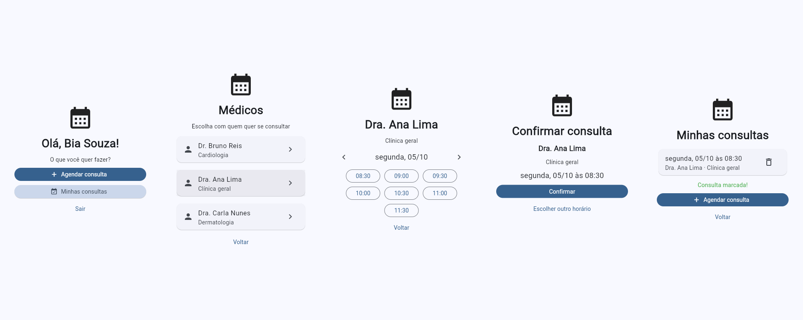

# Agenda

Aplicativo de agendamento de consultas médicas, feito inteiro em Python: o app
de celular usa [Flet](https://flet.dev) e conversa com uma API em
[FastAPI](https://fastapi.tiangolo.com).




## O que o app faz

- Cadastro e login de pacientes
- Lista de médicos por especialidade
- Horários livres de cada médico, dia a dia
- Marcação de consulta com tela de confirmação
- Lista das consultas marcadas, com cancelamento

## Regras de negócio

As regras ficam na API, e não no app, para valerem para qualquer cliente.

- **Horários calculados na hora**: disponibilidade do médico, menos as consultas
  já marcadas, menos o que já passou. Nenhum horário livre fica salvo no banco.
- **Um médico não atende dois pacientes no mesmo horário.** Além da validação na
  API, o banco tem um índice único em `(medico_id, inicio)` para consultas
  agendadas. Assim, dois pedidos simultâneos para o mesmo horário não passam os
  dois.
- **Um paciente não marca dois médicos no mesmo horário.**
- **Não é possível marcar no passado** nem fora do horário de atendimento.
- **Cancelar libera o horário** para outros pacientes, e só o dono da consulta
  pode cancelá-la.
- **Senhas nunca são guardadas**: só o hash, gerado com scrypt e salt aleatório.
- **Login por token JWT**, exigido em todas as rotas da agenda.

## Tecnologias

| Parte | Tecnologia |
| --- | --- |
| App (Android, iOS, desktop, web) | Flet 1.0 |
| API | FastAPI + Uvicorn |
| Banco de dados | SQLite com SQLAlchemy 2 (troca para PostgreSQL pela variável `DATABASE_URL`) |
| Autenticação | JWT (PyJWT) |
| Testes | pytest, rodando no GitHub Actions a cada push |

## Como rodar

Precisa de Python 3.10 ou mais novo.

```bash
   git clone https://github.com/Dv-TiagoCarvalho/Agenda-IA.git
   cd Agenda-IA
python3 -m venv .venv
source .venv/bin/activate        # no Windows: .venv\Scripts\activate
pip install -r requirements.txt
```

A API e o app rodam em dois terminais, os dois com o ambiente ativado.

Terminal 1, a API:

```bash
uvicorn api:app --reload
```

Terminal 2, o app:

```bash
flet run
```

Na primeira execução, a API cria o banco `agenda.db` com três médicos de
exemplo. A documentação interativa das rotas fica em http://127.0.0.1:8000/docs.

Para abrir o app no celular, instale o app Flet (Play Store ou App Store), troque
o `API_URL` em `src/main.py` pelo IP do computador na rede, suba a API com
`uvicorn api:app --host 0.0.0.0` e rode `flet run --android` ou `flet run --ios`.

## Rotas da API

| Método | Rota | O que faz |
| --- | --- | --- |
| POST | `/usuarios` | Cria uma conta |
| POST | `/login` | Devolve o token de acesso |
| GET | `/eu` | Dados de quem está logado |
| GET | `/medicos` | Lista os médicos |
| GET | `/medicos/{id}/horarios?data=AAAA-MM-DD` | Horários livres do médico no dia |
| POST | `/consultas` | Marca uma consulta |
| GET | `/consultas` | Consultas futuras de quem está logado |
| DELETE | `/consultas/{id}` | Cancela uma consulta |

Todas as rotas, menos as duas primeiras, exigem o cabeçalho
`Authorization: Bearer <token>`.

## Testes

```bash
pytest
```

Os testes usam um banco separado, criado e apagado a cada execução, e cobrem o
cadastro, o login e todas as regras de negócio acima.

## Estrutura

```
api.py              API: banco, regras e rotas
src/main.py         App Flet: telas e chamadas à API
tests/test_api.py   Testes da API
docs/               Imagens do README
```

## Próximos passos

- Telas do médico: ver a própria agenda e cadastrar disponibilidade e bloqueios
- Antecedência mínima para cancelar
- Lembrete por e-mail na véspera
- Horários em UTC, para atender mais de um fuso
- Deploy da API e publicação do APK
